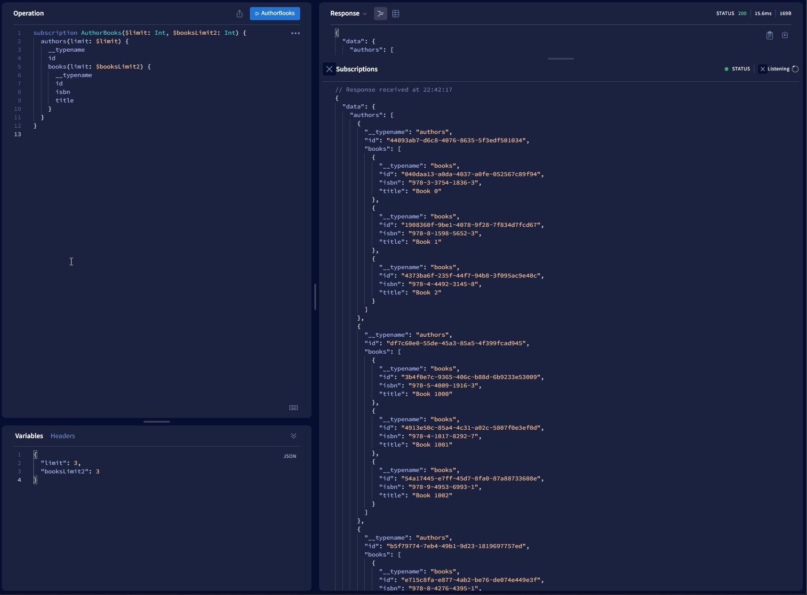
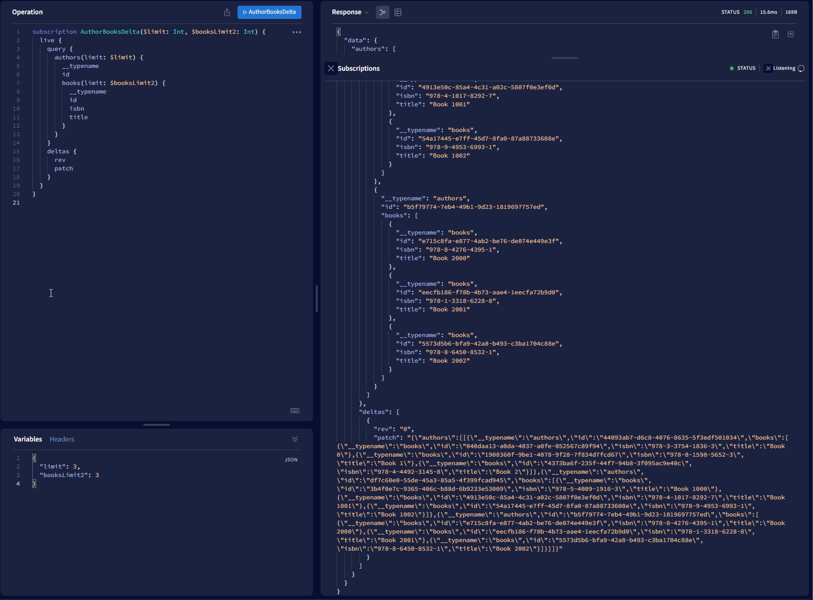

## WARNING ⚠️
This project is highly experimental and unstable. 

## Graphql Delta Gateway

This proof-of-concept was inpired by the desire to change how Hasura subscriptions return their updated result sets to a client. By default, with no filtering or limiting, a Hasura subscription will return the entire updated result set to the client regardless of the magnitude of the change. When the result set is large, or the objects in question have many properties, this can lead to a lot of additional data being sent unnecessarily to the client.

### Current Hasura Subscription Behavior
Given the following subscription and result, any change that affected the result set would emit an update to the client that includes all of the unchanged data as well:


### Delta Gateway Subscription Behavior
This Delta Gateway demo wraps the Hasura schema and exposes it so users can adopt it with minimal changes to their graphql setup. The Delta Gateway adds a new Subscription field `live` that allows for a `query` field (the same as Hasura's `subscription_root`) and a `deltas` field.

The server is able to ascertain the client state from a timestamp provided by the client during the subscription initiation. There is a historical schema and a pair of database triggers added to allow for temporal queries. The triggers record the valid time for a row and its changes, and by querying for a known time frame it is possible to get what the query results should be for any point in time.

When a new Hasura subscription event is emitted (on connect, or on any update), the historical schema is queried to get the client state and the new event is diffed against that client state to produce a patch and a new timestamp to send to the client.

The delta generation uses the combination of `[__typename, id]` to uniquely identify objects in the response. As such, it is highly recommended to include these two fields in the subscription to optimise the patch generation.


### Included Software
Docker compose is used to run the demo. Included are the following:
- Postgresql
- Redis
- Hasura
- Client UI testbed (./client)
- Apollo server express (./apollo-server-express)
- Graphql helix + express (./helix-express)
- Graphql helix + fastify (./helix-fastify)
- OpenTelemetry Collector
- Jaeger

Three http / ws distributions have been provided, but the apollo-server one is the most up-to-date / working.

Note: the client and apollo server uses subscription-transport-ws to allow for graphql-bench subscripton tests to function. The graphql-bench subscription does not work with the graphql-ws protocol, which both graphql-helix implementations use. 

Also included is OpenTelemetry and Jaeger for tracing, which has been used to help identify performance bottlenecks in the delta gateway server. 

## Setup and Usage
Assuming `docker-compose` is available, `npm install` has been run in each directory with a `package.json` file, that the Hasura CLI is available. Initial bringup:
```
$ cp .env.sample .env
$ docker-compose up
```
This should create the postgres database, which needs to be migrated:
```
$ cd migrations
$ npx knex migrate:latest
```
Then, apply the hasura metadata:
```
$ cd hasura
$ hasura metadata apply
```
Stop and restart docker compose. Hasura and the other containers should successfully start. Seed the initial data:
```
$ cd apollo-server-express
$ npm run seed
```
URLs of interest:
```
http://127.0.0.1:3000/ - client UI
http://127.0.0.1:16686/ - Jaeger tracing UI
http://127.0.0.1:8091/ - Hasura UI
http://127.0.0.1:5002/graphql - apollo server graphql UI -> apollo studio explorer
```

Note: tracing is enabled by default, to disable it comment out the `import "./openTelemetry"` at the top of the `src/server.ts` file. Tracing negatively impacts benchmark and production performance.

### Delta Subscription Points of Interest
Each server implementation uses the same setup for proxying to Hasura. This code is predominantly located in the `(apollo-server-express|helix-express|helix-fastify)/graphql` directory.

Remote schema executor: `./apollo-server-express/src/graphql/hasura/schema.ts`
Live subscription + local graphql server: `apollo-server-express/src/graphql/local/schema.ts`


### Todos
- Add toggle for subscription-transport-ws for the graphql-helix servers
- More historical schema testing and bugfixing